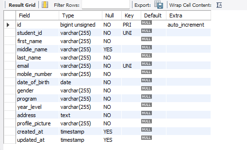
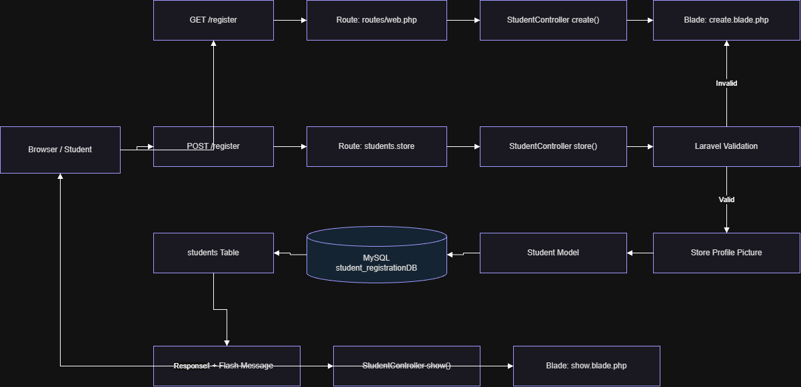
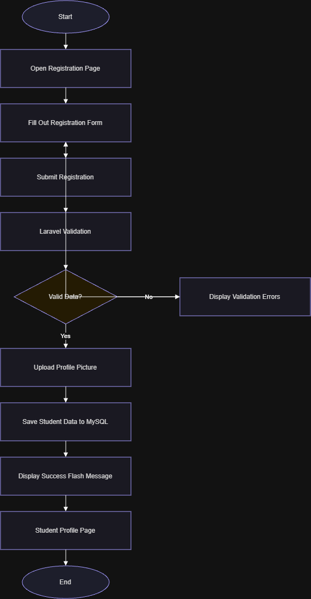
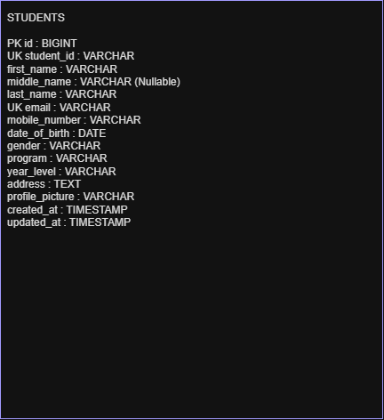
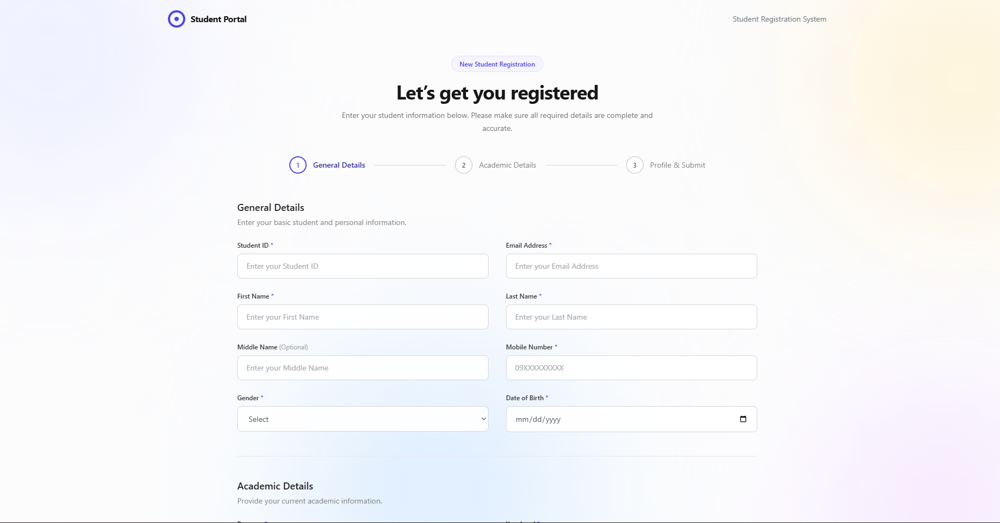
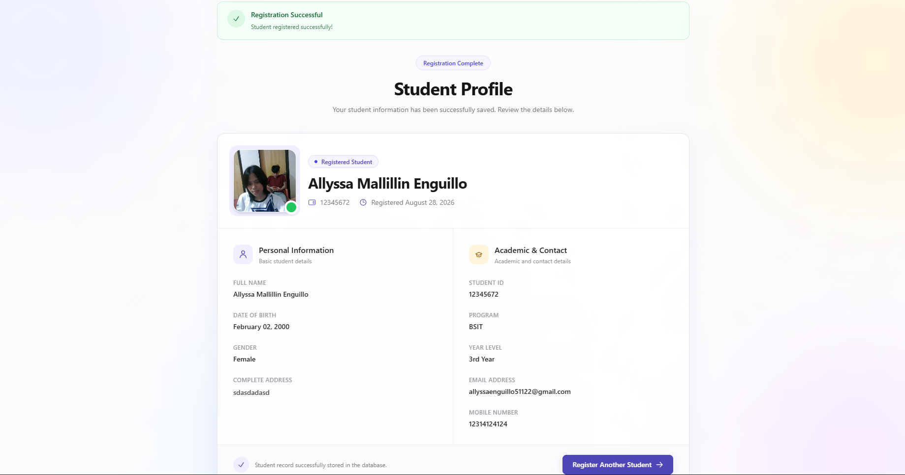

# Student Registration System

## Project Description

The Student Registration System is a web-based application developed using Laravel for the Week 4 laboratory activity in ITST 302 – Client-Server Technologies.

The system allows students to register their personal information, contact details, academic information, address, and profile picture through an online registration form. Before the information is stored, Laravel performs server-side validation to make sure the submitted data follows the required rules.

After a successful registration, the student's information is stored in a MySQL database and the uploaded profile picture is saved using Laravel Storage. The system then redirects the user to a Student Profile page where the registered information and uploaded image are displayed.

The purpose of this project is to demonstrate how Laravel handles client requests, form processing, validation, database interaction, file uploads, flash messages, and Blade templates in a complete student registration workflow.

---

# Features

## Student Registration Form

The system provides a responsive registration form where students can enter the following information:

- Student ID
- First Name
- Middle Name
- Last Name
- Email Address
- Mobile Number
- Date of Birth
- Gender
- Program
- Year Level
- Complete Address
- Profile Picture

The interface is designed using Tailwind CSS with a clean and responsive layout.

---

## Input Validation

The system uses Laravel server-side validation to make sure that submitted student information is complete and valid before it is stored in the database.

Validation includes:

- Required fields cannot be empty
- Student ID must be unique
- Student ID has a maximum allowed length
- First Name is required
- Middle Name is optional
- Last Name is required
- Email address must use a valid email format
- Email address must be unique
- Mobile number must contain a numeric value
- Date of Birth must contain a valid date
- Gender is required
- Program is required
- Year Level is required
- Address is required
- Profile picture must be an image
- Accepted profile picture formats are JPG, JPEG, and PNG
- Maximum profile picture size is 2MB

The validation rules used in the controller include:

```php
$validated = $request->validate([
    'student_id' => 'required|string|max:50|unique:students,student_id',
    'first_name' => 'required|string|max:100',
    'middle_name' => 'nullable|string|max:100',
    'last_name' => 'required|string|max:100',
    'email' => 'required|email|max:255|unique:students,email',
    'mobile_number' => 'required|numeric',
    'date_of_birth' => 'required|date',
    'gender' => 'required|string',
    'program' => 'required|string',
    'year_level' => 'required|string',
    'address' => 'required|string|max:500',
    'profile_picture' => 'required|image|mimes:jpg,jpeg,png|max:2048',
]);
```

---

## Profile Picture Upload

Students are required to upload a profile picture during registration.

Supported formats:

- JPG
- JPEG
- PNG

Maximum file size:

```text
2MB
```

The uploaded image is stored using Laravel's public storage disk.

Example:

```php
$validated['profile_picture'] = $request
    ->file('profile_picture')
    ->store('student-profiles', 'public');
```

Only the image path is stored in the database.

To allow uploaded images to be displayed publicly, the Laravel storage link is created using:

```bash
php artisan storage:link
```

---

## Flash Messages

The system uses Laravel flash messages to inform the user when registration is completed successfully.

After a successful registration, the user receives a message such as:

```text
Student registered successfully!
```

If validation fails, Laravel redirects the user back to the registration form and displays the appropriate validation errors.

---

## Student Profile Display

After successful registration, the system redirects the user to the Student Profile page.

The profile page displays:

- Profile Picture
- Student ID
- Full Name
- Email Address
- Mobile Number
- Date of Birth
- Gender
- Program
- Year Level
- Address
- Registration Date

The page also contains an option to register another student.

---

# Technologies Used

## Frontend

- HTML5
- Tailwind CSS
- Laravel Blade Templates

## Backend

- Laravel Framework
- PHP
- Laravel Eloquent ORM

## Database

- MySQL

## Development Tools

- Visual Studio Code
- Composer
- Git
- GitHub
- phpMyAdmin
- Laravel Artisan CLI

---

# Database Structure

The system uses a MySQL database named:

```text
student_registrationDB
```

The main application table is:

```text
students
```

The `students` table stores the student's personal information, contact details, academic information, address, and profile picture path.

---

# Database Structure Screenshot

Add the screenshot of your MySQL `students` table here:

```markdown

```

---

# Database Table Fields

The `students` table contains the following fields:

| Field Name | Description |
|---|---|
| `id` | Primary key |
| `student_id` | Unique student identification value |
| `first_name` | Student first name |
| `middle_name` | Optional student middle name |
| `last_name` | Student last name |
| `email` | Unique student email address |
| `mobile_number` | Student contact number |
| `date_of_birth` | Student birth date |
| `gender` | Student gender |
| `program` | Student academic program |
| `year_level` | Student current year level |
| `address` | Student complete residential address |
| `profile_picture` | Path of the uploaded profile picture |
| `created_at` | Date and time the record was created |
| `updated_at` | Date and time the record was updated |

---

# System Flow

The system follows this process:

```text
Student Opens Registration Page
            │
            ▼
Fill Out Registration Form
            │
            ▼
Submit Registration
            │
            ▼
Route Handling
(routes/web.php)
            │
            ▼
StudentController
            │
            ▼
Laravel Validation
            │
      ┌─────┴─────┐
      │           │
   Invalid       Valid
      │           │
      ▼           ▼
Display      Upload Profile
Errors         Picture
      │           │
      │           ▼
      │      Student Model
      │           │
      │           ▼
      │      Save to MySQL
      │           │
      │           ▼
      └────── Student Profile Page
```

---

# Laravel Request Lifecycle

The Student Registration System follows Laravel's request lifecycle when processing registration.

## 1. Browser

The student opens the registration page and enters the required information.

When the **Register Student** button is clicked, the browser sends a POST request.

```text
POST /register
```

## 2. Route

Laravel receives the request through:

```text
routes/web.php
```

The POST request is connected to the `store()` method of the `StudentController`.

```php
Route::post('/register', [StudentController::class, 'store'])
    ->name('students.store');
```

## 3. Controller

The `StudentController` receives the submitted information and processes the registration request.

```text
StudentController@store
```

## 4. Validation

Laravel checks the submitted information using server-side validation.

If the information is invalid:

```text
Validation Failed
      ↓
Return to Registration Form
      ↓
Display Validation Errors
```

If the information is valid, the system continues processing the registration.

## 5. File Upload

Laravel checks the uploaded profile picture and stores it inside the public storage disk.

```php
$request->file('profile_picture')
    ->store('student-profiles', 'public');
```

## 6. Student Model

The validated information is passed to the `Student` Eloquent model.

```php
Student::create($validated);
```

The model communicates with the `students` table.

## 7. MySQL Database

The student information is stored in:

```text
student_registrationDB
        │
        ▼
students
```

## 8. Response

After the student record is successfully created, Laravel redirects the user to the Student Profile page.

A success flash message is also displayed.

---

# Laravel Request Lifecycle Diagram

Add your request lifecycle diagram here:

```markdown

```

---

# Registration Flowchart

The registration flowchart illustrates the process from opening the form until the registered student's information is displayed.

```text
Start
  │
  ▼
Open Registration Page
  │
  ▼
Fill Out Form
  │
  ▼
Submit Registration
  │
  ▼
Laravel Validation
  │
  ▼
Valid Data?
  │
  ├──────────── No ────────────┐
  │                            │
 Yes                           ▼
  │                     Display Errors
  ▼                            │
Upload Profile Picture         │
  │                            │
  ▼                            │
Save Student to Database       │
  │                            │
  ▼                            │
Success Flash Message ◄────────┘
  │
  ▼
Student Profile Page
  │
  ▼
End
```

Add your graphical flowchart here:

```markdown

```

---

# Database ER Diagram

The current system uses one main entity called `Student`.

```text
┌─────────────────────────────────┐
│             STUDENT             │
├─────────────────────────────────┤
│ PK  id                          │
│ UQ  student_id                  │
│     first_name                  │
│     middle_name                 │
│     last_name                   │
│ UQ  email                       │
│     mobile_number               │
│     date_of_birth               │
│     gender                      │
│     program                     │
│     year_level                  │
│     address                     │
│     profile_picture             │
│     created_at                  │
│     updated_at                  │
└─────────────────────────────────┘
```

Add your graphical ER diagram here:

```markdown

```

---

# Laravel Project Structure

The main files used by the Student Registration System include:

```text
week04-student-registration/
│
├── app/
│   ├── Http/
│   │   └── Controllers/
│   │       └── StudentController.php
│   │
│   └── Models/
│       └── Student.php
│
├── database/
│   └── migrations/
│       └── xxxx_xx_xx_xxxxxx_create_students_table.php
│
├── resources/
│   └── views/
│       └── students/
│           ├── create.blade.php
│           └── show.blade.php
│
├── routes/
│   └── web.php
│
├── storage/
│   └── app/
│       └── public/
│           └── student-profiles/
│
├── documentation/
│
├── screenshots/
│
├── .env
├── composer.json
└── README.md
```

Add the screenshot of your actual VS Code project structure here:

```markdown

```

---

# Application Routes

The application uses routes for displaying the registration form, processing registration, and displaying registered student information.

```php
use Illuminate\Support\Facades\Route;
use App\Http\Controllers\StudentController;

Route::get('/', function () {
    return redirect()->route('students.create');
});

Route::get('/register', [StudentController::class, 'create'])
    ->name('students.create');

Route::post('/register', [StudentController::class, 'store'])
    ->name('students.store');

Route::get('/students/{student}', [StudentController::class, 'show'])
    ->name('students.show');
```

---

# Installation Guide

## 1. Clone Repository

```bash
git clone https://github.com/enguilloallyssa/week04-student-registration.git
```

Enter the project folder:

```bash
cd week04-student-registration
```

---

## 2. Install Dependencies

```bash
composer install
```

---

## 3. Setup Environment File

Create a copy of `.env.example`.

### Windows

```bash
copy .env.example .env
```

### macOS / Linux

```bash
cp .env.example .env
```

---

## 4. Configure Database

Update the database configuration inside `.env`:

```env
DB_CONNECTION=mysql
DB_HOST=127.0.0.1
DB_PORT=3306
DB_DATABASE=student_registrationDB
DB_USERNAME=root
DB_PASSWORD=
```

Create the MySQL database if it does not exist:

```sql
CREATE DATABASE student_registrationDB;
```

---

## 5. Generate Application Key

```bash
php artisan key:generate
```

---

## 6. Run Database Migration

```bash
php artisan migrate
```

This creates the required database tables including the `students` table.

---

## 7. Create Storage Link

For profile picture uploads:

```bash
php artisan storage:link
```

---

## 8. Clear Laravel Cache

```bash
php artisan optimize:clear
```

---

## 9. Run the Application

```bash
php artisan serve
```

Open the registration page:

```text
http://127.0.0.1:8000/register
```

---

# Screenshots

The `screenshots/` folder contains visual evidence of the completed application.

Recommended screenshots include:

- Registration Form
- Validation Errors
- Successful Registration
- Flash Success Message
- Uploaded Profile Picture
- Student Profile Page
- MySQL Database Records
- Laravel Project Structure
- GitHub Repository
- Terminal Output
- Browser Output

Example:

```text
screenshots/
├── registration-form.png
├── validation-errors.png
├── successful-registration.png
├── flash-message.png
├── uploaded-profile-picture.png
├── student-profile.png
├── database-records.png
├── project-structure.png
├── github-repository.png
├── terminal-output.png
└── browser-output.png
```

---

# Student Registration Page

```markdown

```

---

# Student Profile Page

```markdown

```

---

# Testing

The Student Registration System was tested using valid and invalid registration scenarios.

## Valid Registration

### Test

The form is submitted using:

- Unique Student ID
- Complete required information
- Valid email address
- Numeric mobile number
- Valid Date of Birth
- Selected gender
- Selected program
- Selected year level
- Complete address
- JPG, JPEG, or PNG profile picture below 2MB

### Expected Result

- Student information passes validation
- Profile picture is uploaded successfully
- Student information is stored in MySQL
- Success flash message is displayed
- Student Profile page is displayed
- Uploaded profile picture appears on the profile page

---

## Invalid Registration

### Test

The form is submitted using one or more invalid fields.

Examples:

- Missing Student ID
- Duplicate Student ID
- Missing name
- Invalid email format
- Duplicate email address
- Non-numeric mobile number
- Missing program
- Missing year level
- Missing address
- Invalid image format
- Image larger than 2MB

### Expected Result

- The registration is rejected
- Invalid data is not stored in the database
- Validation messages are displayed
- Previously entered valid information remains in the form

---

# Problems Encountered

## 1. Student ID Column Not Found

### Problem

During form submission, Laravel displayed the following database error:

```text
SQLSTATE[42S22]: Column not found:
Unknown column 'student_id' in 'where clause'
```

The registration controller was already validating the `student_id` field, but the existing `students` table did not contain the required `student_id` column.

### Solution

The students migration was updated to include:

```php
$table->string('student_id')->unique();
```

Because the project was still under development and there was no important data that needed to be preserved, the database tables were recreated using:

```bash
php artisan migrate:fresh
```

After running the migration again, the `student_id` column was correctly created in the `students` table.

---

## 2. Mass Assignment Error

### Problem

After fixing the database table, Laravel displayed:

```text
Illuminate\Database\Eloquent\MassAssignmentException
```

The application was using:

```php
Student::create($validated);
```

but the Student model did not allow the submitted fields to be mass assigned.

### Solution

The required fields were added to the `$fillable` property inside `Student.php`.

```php
protected $fillable = [
    'student_id',
    'first_name',
    'middle_name',
    'last_name',
    'email',
    'mobile_number',
    'date_of_birth',
    'gender',
    'program',
    'year_level',
    'address',
    'profile_picture',
];
```

This allowed Laravel Eloquent to save the validated student information correctly.

---

## 3. Profile Picture Storage

### Problem

Uploaded profile pictures are stored inside Laravel's storage directory, but files inside this directory cannot automatically be accessed directly through the browser.

### Solution

The Laravel public storage link was created using:

```bash
php artisan storage:link
```

The profile picture can then be displayed using:

```blade
profile_picture) }}"
    alt="Student Profile Picture"
>
```

---

# Reflection

Developing the Student Registration System helped me understand that creating a registration feature involves more than simply making a form and storing information in a database. Before working on this activity, I thought the main part of a registration system was the user interface. As I continued developing the project, I realized that validation, database structure, request handling, file uploads, and proper error handling are also important parts of a complete web application.

One of the most important things I learned was the importance of server-side validation. Users can enter incomplete or incorrect information, and without validation these values could be saved directly into the database. Laravel's validation system helped me control the type of information that the application accepts. For example, Student IDs and email addresses must be unique, important fields cannot be left empty, the mobile number must be numeric, and profile pictures must use an accepted image format. These validation rules help keep the stored information accurate and organized.

I also learned the difference between client-side and server-side validation. Client-side validation can provide faster feedback to users, but it should not be the only validation used in a web application because browser-based validation can be bypassed. Server-side validation checks the data again after the request reaches the application. Because of this, server-side validation provides a more reliable way of protecting the database from invalid information.

Another important lesson from this project was handling file uploads. Profile pictures cannot be handled in the same way as normal text fields. The uploaded image needs to be validated and stored in a proper directory, while only its path is saved in the database. I also learned why applications should restrict uploaded file types and sizes. Allowing any type of file could create security or storage problems. Using Laravel Storage and the `storage:link` command helped me understand how uploaded files can be securely stored and later displayed in the browser.

During development, I also encountered several errors that helped me better understand Laravel. One error happened because the `student_id` field was being used by the application but was missing from the existing MySQL table. Fixing the migration and recreating the database tables taught me that the migration file and actual database structure must remain synchronized. I also encountered a mass assignment error when using `Student::create()`. I fixed this by adding the student fields to the `$fillable` property of the Student model.

The activity also helped me understand Laravel's request lifecycle. When the registration form is submitted, the browser sends a request to a route. The route forwards the request to the controller, validation checks the information, the model communicates with the MySQL database, and Laravel returns a response to the browser. Seeing each component work together made Laravel's MVC structure easier for me to understand.

Overall, this project improved my knowledge of Laravel, PHP, MySQL, Blade templates, Tailwind CSS, validation, file uploads, database migrations, Eloquent models, and Git version control. It also showed me how registration systems are used in real-world applications where accurate and secure data collection is important. Building the system from the registration page to the final student profile gave me practical experience in creating a complete client-server web application.

---

# References

Laravel. (2026). *Laravel documentation*.  
https://laravel.com/docs

MDN Web Docs. (n.d.). *HTML forms*. Mozilla.  
https://developer.mozilla.org/en-US/docs/Learn_web_development/Extensions/Forms

MySQL. (n.d.). *MySQL reference manual*. Oracle.  
https://dev.mysql.com/doc/

PHP. (n.d.). *PHP manual*.  
https://www.php.net/manual/en/

Tailwind Labs. (n.d.). *Tailwind CSS documentation*.  
https://tailwindcss.com/docs

---

# Author

Developed by:

Allyssa Enguillo

ITST 302 – Client-Server Technologies  
Week 4 Laboratory Activity  
Mini Project 03 – Student Registration System  

2026